---
# Create and Test your API 

# 1. API Connect Overview

**IBM API Connect** is a comprehensive end-to-end API lifecycle solution that enables the automated creation of APIs, simple discovery of systems of records, self-service access for internal and third party developers and built-in security and governance. Using automated, model-driven tools, create new APIs and microservices based on Node.js and Java runtimes—all managed from a single unified console. Ensure secure & controlled access to the APIs using a rich set of enforced policies. Drive innovation and engage with the developer community through the self-service developer portal. IBM API Connect provides streamlined control across the API lifecycle and also enables businesses to gain deep insights around API consumption from its built-in analytics.

### Components in API Connect

Find below a list of the main components in API Connect :

- **Gateway** (either DataPower, either a NodeJS implementation called micro gateway in this case). The requests from apps are going through the gateway, policies are enforced and analytic are gathered.
- **Manager** where the APIs are defined and governed. It also collects the analytics from the gateway. The manager can be used directly or more likely using the toolkit.
- **Portal**, an open source Drupal CMS - Content Management System. For the API consumers (Apps developpers), they create Apps and subscribe to API within the portal. Based on Drupal, it is highly customizable.
- **Loopback runtime** or micro services runtime. This is where the loopback applications are running. This component is originally coming from StrongLoop acquisition. Loopback applications can be created in minutes to expose data from SQL or NoSQL database and also a good place to perform composition of APIs.
- Associated to the Loopback runtime is the **Kubernetes** that monitors the Loopback runtime and can provide advanced feature such as auto-scaling.
- **Developer Toolkit**, running on the API developer, it offers the same web experience as the manager to manage APIs. But this is also the only place where you can define Loopback applications. It also contains CLI to operate directly on the manager whether it is an onPremise version or Bluemix version of API Connect.

### Terminology

- **API** : Can be SOAP or Representational State Transfer - REST API defined with an Open API definition (Swagger) as a YAML file. One API = one yaml file though WSDLs and Schema are separated in a zip file for a SOAP API.
- **Plan** : this is where we specify the quotas and if an approval is needed to subscribe to a Product/API.
- **Product** : this is an aggregation of APIs, and one or many plans associated to those APIs. This is what is published to a catalog. One Product = one yaml file.
- **Catalog** : it's relates to a cluster of gateways and a portal. It sounds like an environment but it also contains a business dimension. For example, good names for a catalog are Sandbox, Dev, Production, CRM (for my CRM APIs exposed to a specific population), etc ...
- **API Connect Cloud** : not to be confused with a cloud infrastructure/platform, it is a combination of gateways clusters, managers cluster, portal clusters and loopback applications runtimes. Usually a customer will have one, two, sometime three or more API Connect clouds, based on its organization and needs to separate the infrastructures.
- **Assembly** panel : this is where we specify the policies to be executed in the gateway for each transactions.

### Architecture 

IBM API Connect can work on Premises or in a Cloud. 
Find below the architecture details of the solution in the IBM Cloud that we are going to use during this labs :

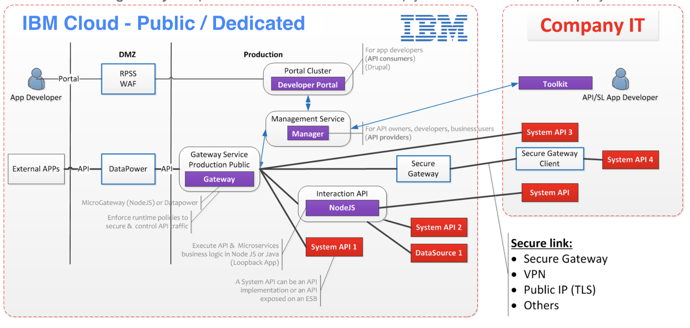

### Concept Map

We often speak about an API Connect **Cloud** which represents an instantiation of all the components of API Connect. The following diagram describes all the relationships between all the components. 
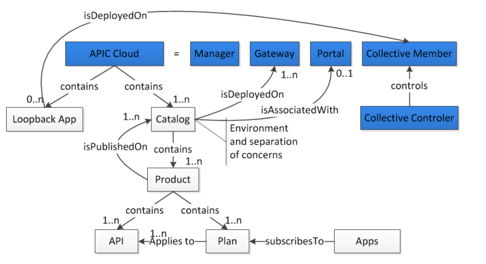

### Plans & Products

To make an API available to a customer, it must be included in a **Plan**. Plans are used to differentiate between different offerings. Plans can share APIs, but whether subscription approval is required depends upon the Plan itself. Additionally, you can enforce rate limits through Plans or through operations within a Plan's APIs that override the Plan's rate limit.

**Products**

Plans and APIs are grouped in Products. Through Products, you can manage the availability and visibility of APIs and Plans. Use the API Designer to create, edit, and stage your Product. Use the API Manager to manage the lifecycle of your Product.

The following diagram demonstrates how Products, Plans, and APIs relate to one another. Note how Plans belong to only one Product, can possess different APIs to other Plans within the same Product, and can share APIs with Plans from any Product. Figure to show the hierarchy of Products, Plans, and APIs. 

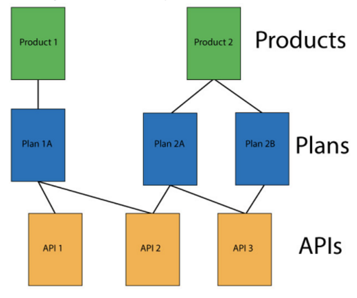

### Product LifeCycle

When you manage your Product versions, you move them through a series of lifecycle states, from initially staging a draft Product version to an environment, through to publishing to make the Product version available to your application developers, and to eventual retiring and archiving. The following table and diagram describe the various Product lifecycle states for a Product version.

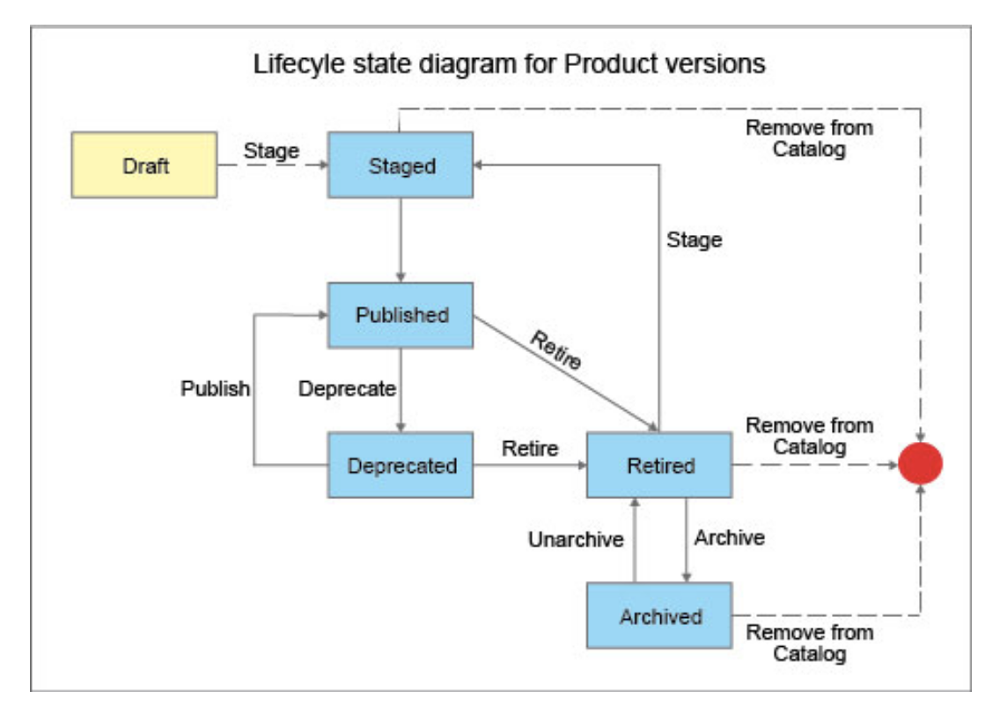

# 2. Objectives

In this workshop, you will use **API Connect** to define a simple REST API and an API Product in your private instance of API Connect in the **IBM Cloud**. This API is providing a **quote for a loan request**. The back-end application has already been implemented somewhere in the IBM Cloud thru Java code. 

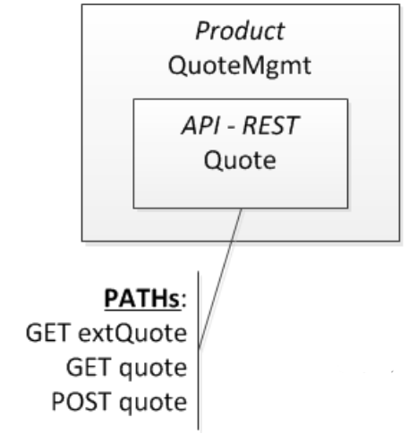

You will learn:

- Goals of API Connect (Presentation)
- Basics on the architecture of the API Connect and terminology useful with API Connect (Presentation)
- How to create and test a REST API definition (Lab)
- How to publish an API to the IBM Cloud (Lab)
- How to subscribe to an API previously published and test in the Developer Portal (Lab)
- How to manage security and analytics about APIs (Lab)

**IMPORTANT**

> This lab is running on the **IBM Cloud** (ex Bluemix) or **on-premise**.
>
> **If you run this lab on premise, please refer to you instructor** to know the IP to get access to API manager and **skip to task 12**.

# 3. Prerequisites (IBM Cloud)

Before you begin, you will need to get an API Connect running on premise or on IBM Cloud.

**And you should be connected to the API Manager.**

# 4 - Expose an existing REST API 

In this first step, we assume that a developer of an API is providing you the Swagger source associated with that API. The developer is using WAS Liberty as the runtime and he also uses JAX-RS annotations along api discovery feature. This allows him to get a Swagger easily consumed by API Connect.

In this lab, we are going to use the IBM Cloud to implement the API but we can also use the Developer Toolkit (in another lab).

> Note: Using the Developer Toolkit (locally) or using API Connect manager directly (remote server) is a pretty important decision. Using the toolkit allows to use a Source Control Management System and perform micro versioning as well as backup of the various yaml (and wsdl). It also provides a local experience with a very low response time. Using the Manager simplifies sharing the API Drafts. In reality, there are ways to benefit of both approaches.

### Task 1 :  Download the API swagger source to your laptop
Follow this link to download the source definition of the API. 

[Link Here](https://github.com/phthom/Using-IBM-API-Connect/blob/master/QuoteManagementAPI_AW_S.yaml)

or 

https://github.com/phthom/Using-IBM-API-Connect/blob/master/QuoteManagementAPI_AW_S.yaml

### Task 2 :  Create a Product
Depending where you are in the API Connect console, Click on the chevrons (**>>**) to get access to the navigation menu on the left side.

Choose **Drafts** to implement the product. 

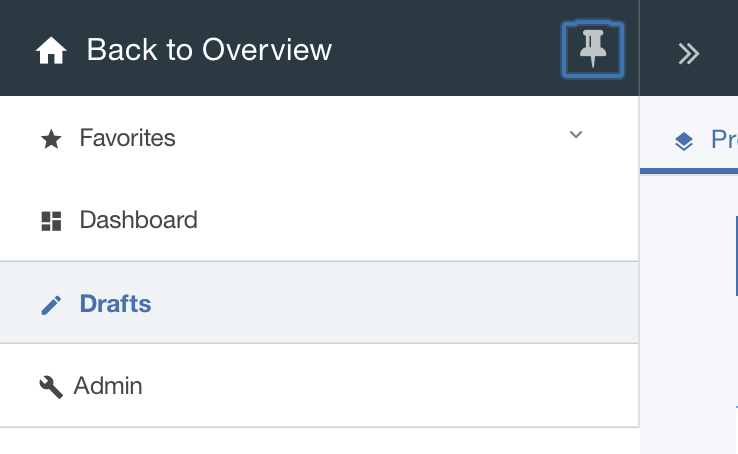

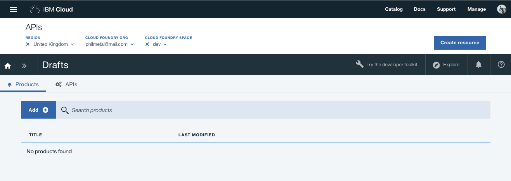

Click the **Add** button, select **New product**. 

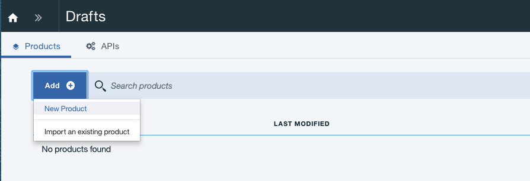

In the Title section, enter **QuoteMgmt**. 

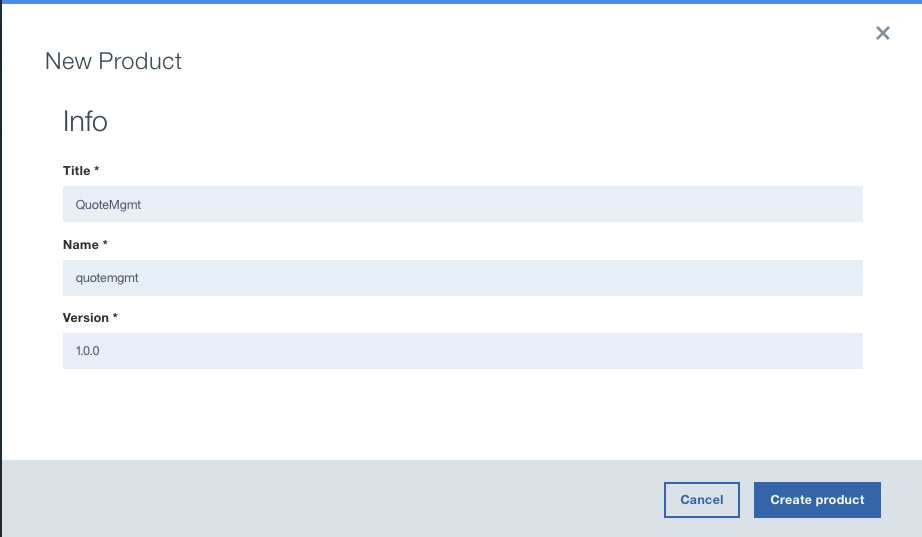

Click **Create product** button.

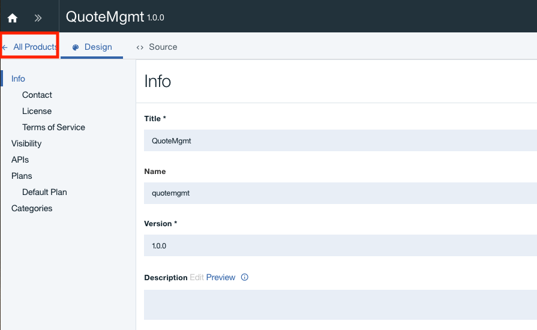
Go back to **All Products**.

### Task 3 :  Create (import) the API

Click on **APIs** in the menu.

Now we can create the API that will be included later in the Product just created. Click on **Add** and then on  **Import API from File or URL**.

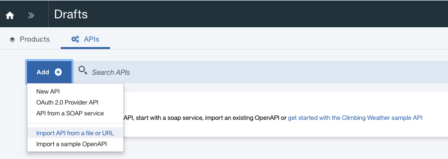

Specify the location of the Swagger file you just downloaded. Click **Import**.

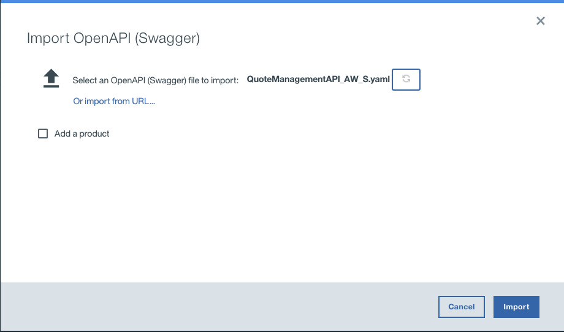

### Task 4 :  Modify the definitions of the API

We need to complete/review a few informations, that were not specified in the generated Swagger. The amount of information that need to be completed will depend greatly on the use of the annotations or the Swagger generator used.

Click on **Design** in the top menu.  
Select https for the scheme, in the Schemes section. 
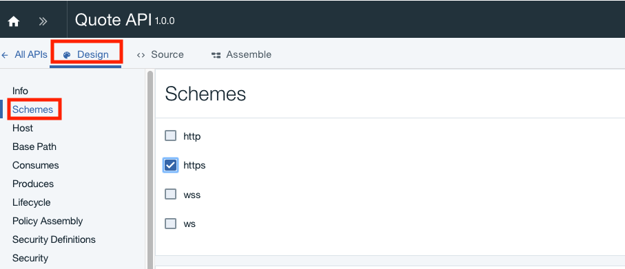

Create the security definition, click on + sign close to the Security Definitions section.

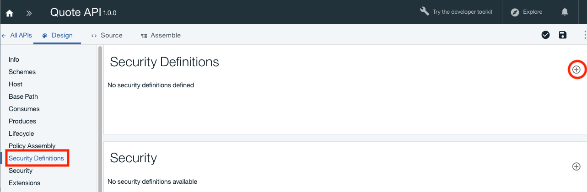

Select **API Key**.

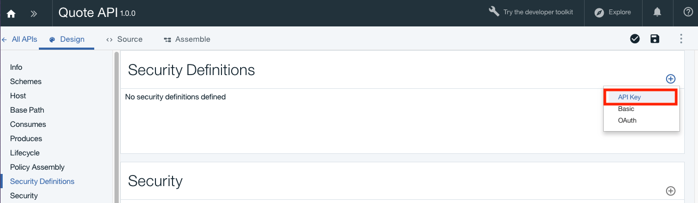

Enter **client-id** in the name.

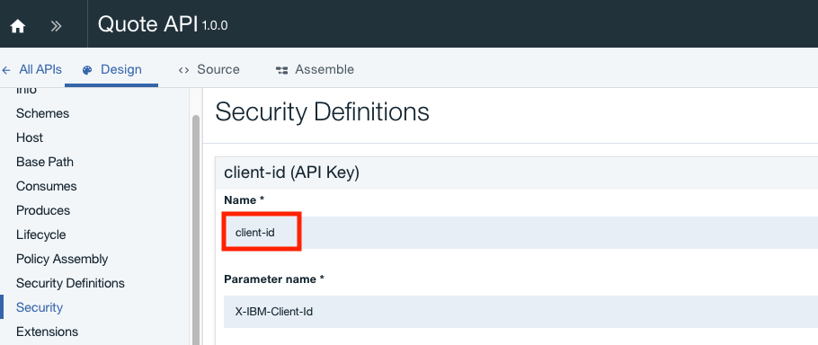

Specify the security of the API, click on the + sign close to the Security section, and check the client-id API Key (3 steps)

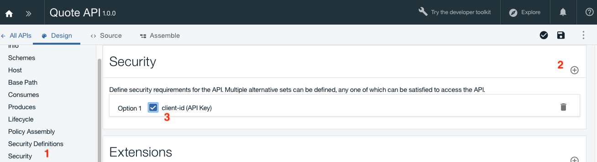

Create a property to define the target-url of the back end API. This allows us to create a variable that may take different values based on the catalog instance. Click on the + sign close to the Properties section. Set the Property name to **target-url**, and enter 
http://SampleJAXRS20-aw.eu-gb.mybluemix.net in the value, close to Default value. 

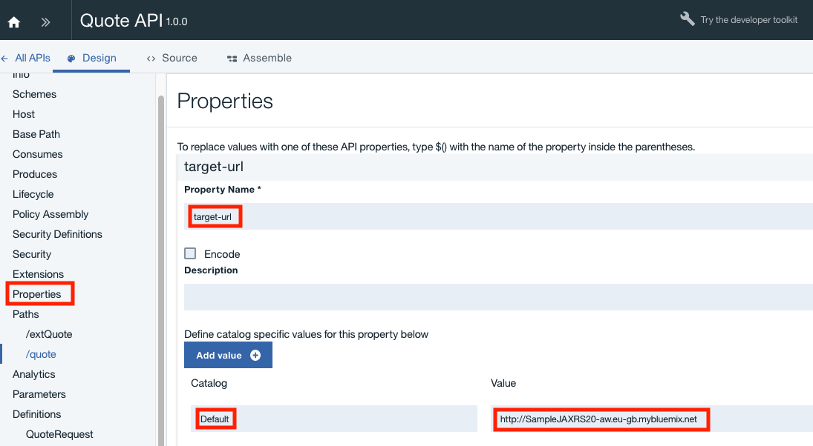

Click on the Assemble menu, click on the **Invocation** policy, and set the URL property to $(target-url)$(request.path)$(request.search)

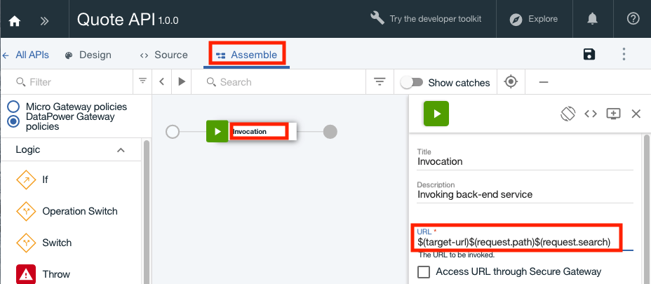

Save the changes, by clicking on the Save diskette icon at the top.

### Task 5 :  Testing the new created API

To test the API from an API provider perspective, click on Assemble, in the left hand side panel, switch from Micro Gateway policies to **DataPower Gateway** policies if necessary.
Save the change. Click on the **read icon**, check the catalog to run the API, select the **QuoteMgmt** product if necessary.

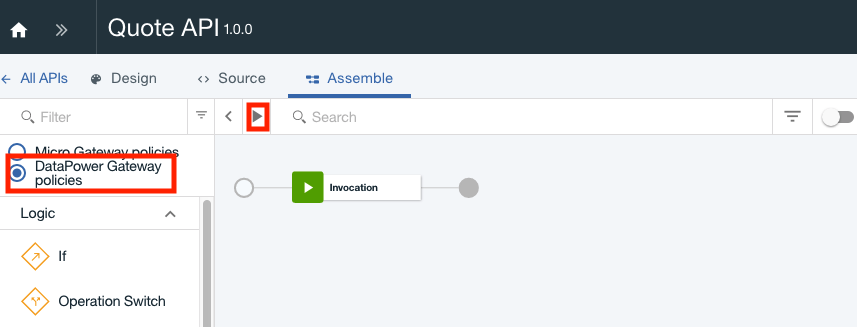

Because we didn't associate this API to any Product, if we want to live test the API, we have to change the setup for the test. Click on **Change Setup**

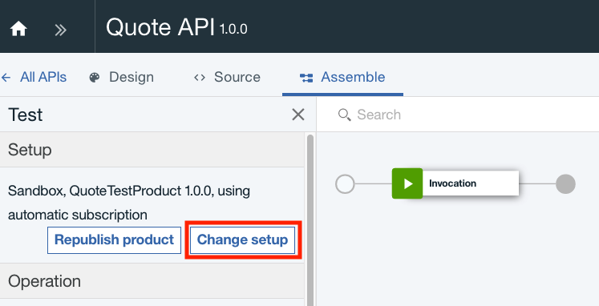

Specify a testing product name like **QuoteTestingProduct** and click on **Create and publish** :

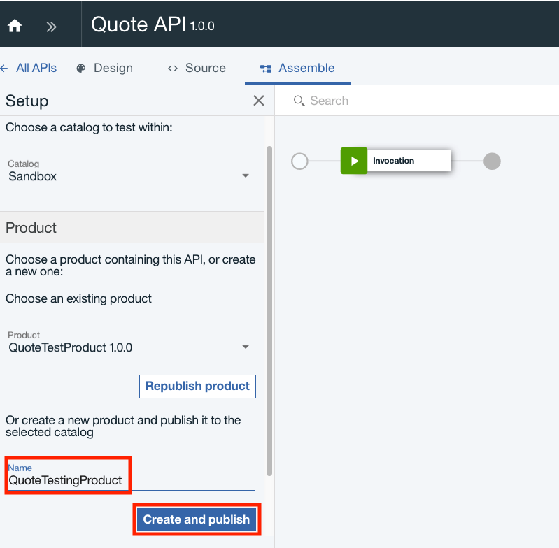

Then Click **Next**

Select the operation : **get /extQuote** 
> Don't click on the other buttons. 
> 
> Notice the change at the top : QuoteTestingProduct 1.0.0

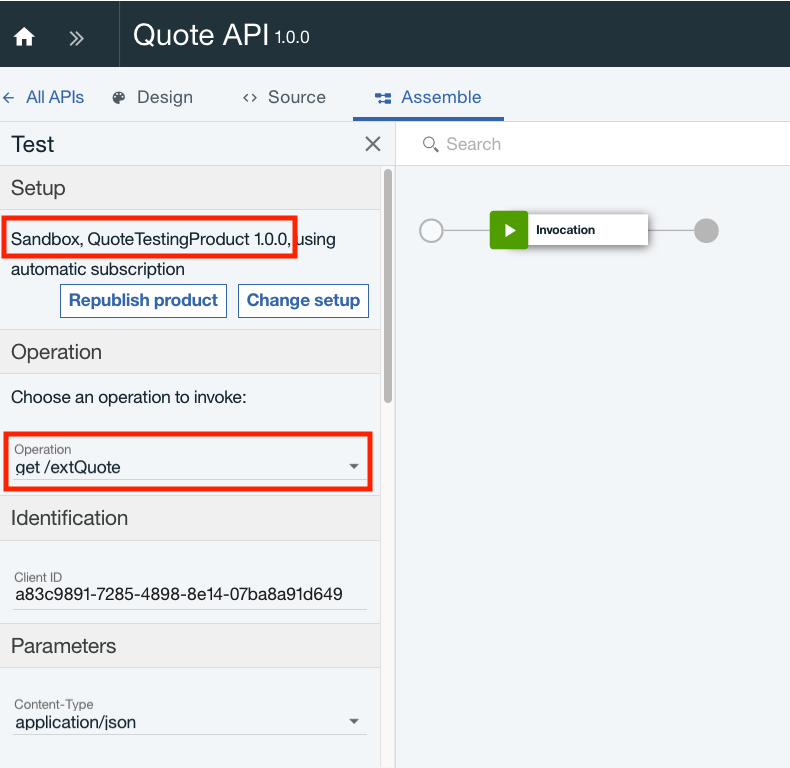

Enter the parameters (amount 1000, rate 1.1, duration 36, delay 10, msg length 11) and click invoke. 
> Don't change the generated Client ID.

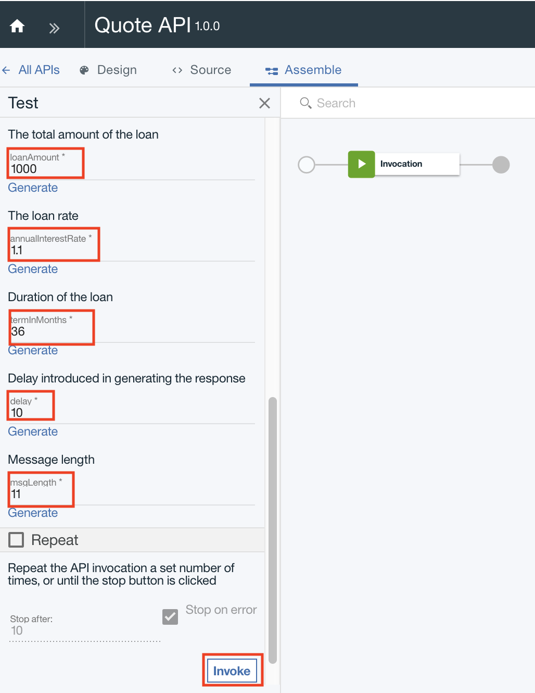

Here is a example of the answer :

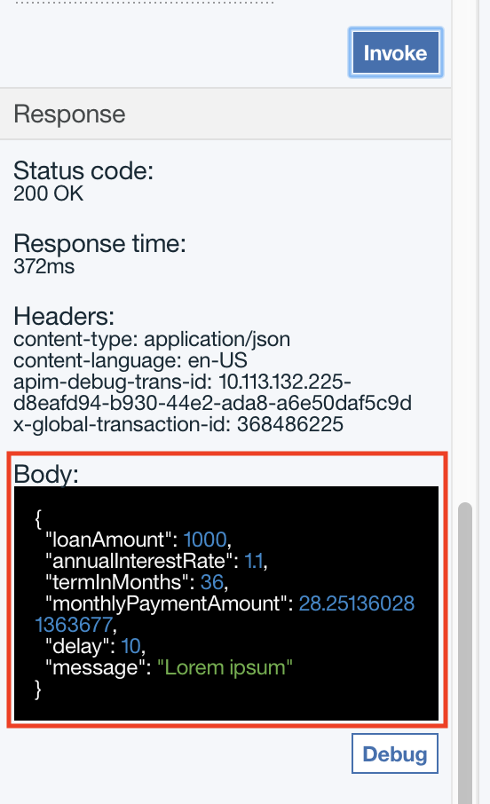

### Task 6 :  Exploring the API

You can also test the API using the explore facility. You get a view similar to the API consumer in the portal, but in this case you do not need to create an Apps and subscribe to the API. Click on the **Explore** link on the top right, you see the documentation and have the possibility to test the various operations. 

Click on the **Sandbox** link :

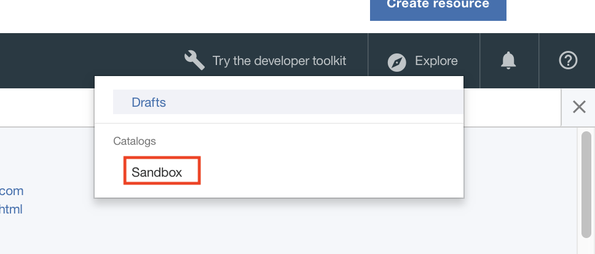

Select the operation : **get /extQuote** then click on **Try it**

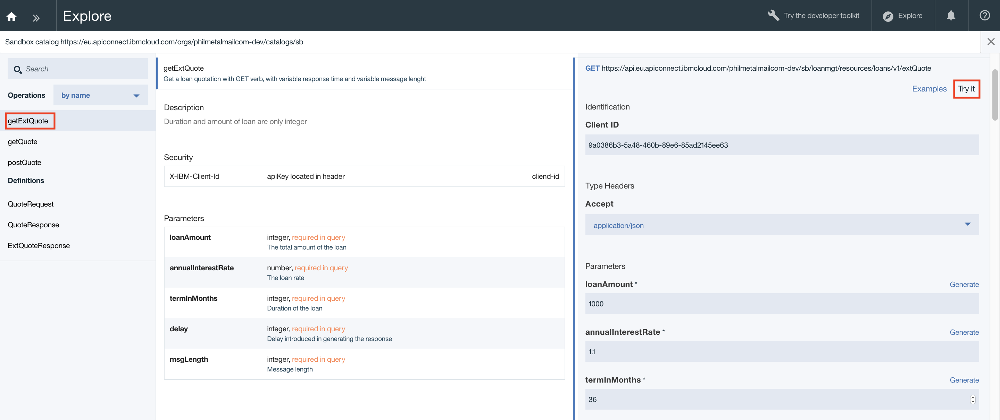

Fill the request for the loan as you did previously and click on **Call Operation**

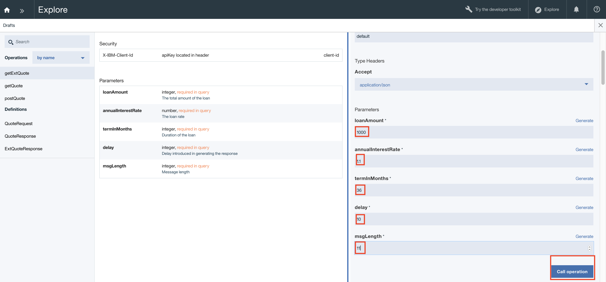

See the result of the request :

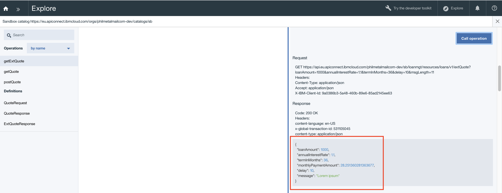

Click the X icon on the top right to close the explore window.

# 5. Conclusion

###  Results
Successful exercise ! 
You finally went thru the following features :

- [x] You imported an API to that instance
- [x] You added API key and some security definitions to that API
- [x] You tested the API before publishing

---
# End of Lab
---

<b>
 Using IBM API Connect
 </b></a>
