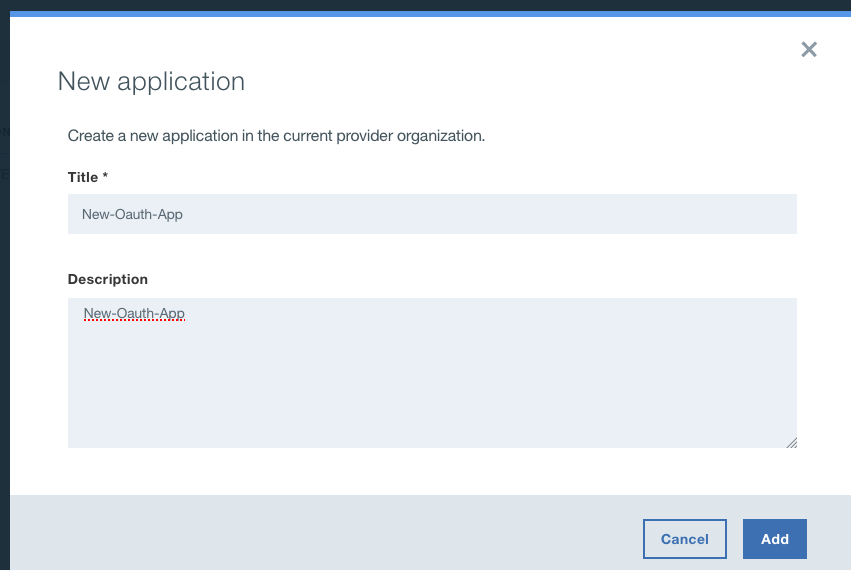

# OAUTH2 with API Connect

Prerequisites:

- API Connect 5.0.6 on-premise or in IBM Cloud or later version
- Chrome browser
- Postman Application

Please download the following zip file from that URL:

http://developer.ibm.com/apiconnect/wp-content/uploads/sites/23/2017/04/OAuthDemo.zip

This zip file contains the following files:

1.  Three API Yaml files (2 OAuth provider API, 1REST API)
2. One Product Yaml file
3. Postman Collection file

**Unzip that OAuthDemo.zip file** that you have previously downloaded

### Confidential Client OAuth Provider API

Go to Drafts

Let’s first start with the configuration of APIConnect. Import the attached **three APIs** and the **Product** file.

Then go back to **All APIs** and them import the 3 yams files :

Go to Products and import the product yaml file :

And you should get :

Here let’s take a quick look at the [confidential-client-oauth-provider](https://apimanager.eu-gb.apiconnect.cloud.ibm.com/apim/?region=eu-gb&guid=66980bec-df5e-41df-bddd-b056ebf862ff&GHE542_env_id=eu-gb&env_id=ibm:yp:eu-gb&authUrl=https://mccp.eu-gb.bluemix.net/login&ace_config={%22region%22:%22eu-gb%22,%22crn%22:%22crn:v1:bluemix:public:apiconnect:eu-gb:s/cdc57701-a837-41ad-b2e8-b869c5301a89:66980bec-df5e-41df-bddd-b056ebf862ff:cf-service-instance:%22,%22resource_id%22:%22%22,%22orgGuid%22:%22fc323fb8-39fd-4a7f-9a3e-3aefb11fd2db%22,%22spaceGuid%22:%22cdc57701-a837-41ad-b2e8-b869c5301a89%22,%22redirect%22:%22https://cloud.ibm.com/resources%22,%22bluemixUIVersion%22:%22v6%22}&spaceId=cdc57701-a837-41ad-b2e8-b869c5301a89&code=h5a1nfk8hbg&org=5c35b9c50cf2e291c1f4c25f&apim_url=https://apimanager.eu-gb.apiconnect.cloud.ibm.com/apim/?org=5c35b9c50cf2e291c1f4c25f#/design/apis/editor/5c35c2bb0cf2128eecb62bc8) and the minimal changes I have done compared to the default provider API.

I have updated the **base path** to be “/confidential” and the client type is made “**confidential**”.

I have left the scopes as is, scope1 is what we will be using for testing.

I have updated the authentication URL to http://httpbin.org/basic-auth/kriti/kriti for a specific user. Any URL that will return a 200 OK for a given user should work.

I have enabled OAuth Introspection. We will be testing it.
Refresh tokens are enabled by default. We will be testing this also.
Also, I have removed the security definitions and requirements.
Everything else is left to the default values.

### Public Client OAuth Provider API

public-client-oauth-provider.yaml is exactly the same as the confidential provider, except that the **base path** is “/public” and the client type is left with the default value of “public”.
So these are the two OAuth provider APIs.

### API Secured using OAuth

As you can see, I have also included the **auth-secured-api.yaml**, This is **not** an OAuth provider API, but this API expects an access token with scope as “**Scope1**”. 

Take a quick look at the assembly of this API. Here I’m retrieving the oauth related context variables. This is to demonstrate to you that on successful validation of an access token, various Oauth parameters are available as context variable in the assembly.

Go to the products : 

Stage  the product **OAuthDemo** to the SandBox catalog.

Go back to the Dashboard and click on SandBox :

Publish the product **OAuthDemo** to the SandBox catalog :

### Create Application

Next create a client application, by going to. Dashboard -> SandBox -> Community -> Application -> Add. 

Copy the client id and client secret to a notepad. 

We will need this shortly in our postman application.

Subscribe to a plan in  the catalog (right click on the 3 dots)

One thing to note here is that when applications are created here, they are assigned a default redirect uri of “https://localhost”.

So this completes the configuration of the APIConnect.

### Get Gateway URL

One last thing we will need, before we can get to the Postman is the **Gateway url** where this API is enforced. One quick way of finding this is to go to the assembly section and invoke a test (click on the read button just below source)

Choose the product and then Republish the product.

Then Choose the operation (getOAuthCtxVars)  and click INVOKE

And then click DEBUG :

You don’t have to specify any test parameters, but you can grab the gateway url from the debug window. 

Only copy the base path – up to the catalog name (sb for sandbox). Rest are hard coded in the postman collection.

https://159.122.204.52:443/sabapic00yandexru-dev/sb/

### Postman Application Settings

Now let’s move onto the Postman application.

Import the attached “**OAuth-demo**” collection. A few settings that you might want to do in the app:
enable interceptor.

In the settings tab,I have disabled the “automatically follow redirects” setting and also the disabled sending any additional headers.

Then create an environment.-> Manage environment. Add new environment. Add three parameters with these exact names as these are referenced in the collection that you have just imported.

copy and paste the values that you had copied in notepad for
client_id
client_secret
url

One more thing that you will have to do is go to the chrome browser and hit this gateway url to accept the SSL certificate from the gateway.

And accept (add) exception).

Good to go.

### Test Authorization code grant type

So, let’s first test the Authorization Code flow with confidential client. As you can see, the request makes use of the environment variables url and client id. Also note the redirect urid is set to “https://localhost” as I had mentioned earlier. The user name and password are set to values that will be authenticated successfully by the auth url configured in the API. The scope is scope1.
Hit send. 

The code is available in the Location response header. Copy and paste the code to the next request az-code-to-token. All other required parameters are pre-populated for you. hit send. There you go. You got the access token from the provider.

Copy and paste the code to the next request **az-code-to-token**. All other required parameters are pre-populated for you. hit send. There you go. You got the **access token** from the provider.

### Test Implicit grant type

Next let’s try the implicit grant type. 

Response type is token, rest of the parameters are pretty much the same. Hit send. Here the access token is returned in the Location header as a fragment. Note that no refresh token is returned for implicit grant type.

### Test Client Credentials grant type

Next, client credentials grant type. The client id and secret are specified in the post body and the access token is obtained. Again, no refresh token returned for this grant type also.

### Test Password grant type

Next, the password grant type is straight forward. You specify both the client credentials and the resource owner credentials to the token endpoint. You get both access token and **refresh token**.

Hit send :

### Test Refresh token

Finally, it is the refresh token grant type. Lets get the refresh token from any of the previous requests and paste it in the refresh token post body value here.
There you go, the token is refreshed.

Hit send :

### Test Token introspection

I have also included the test for introspection endpoint. Simply copy the access token from one of the previous requests and send it to this endpoint. You can see the contents of the access token.

The public client folder contains the exact same set of requests, except that the client secret is removed appropriately and it gets sent to the /public base path Provider API.

### Test Resource request

For the sake of completeness, let’s actually use the access token obtained to invoke the api that is proteced using OAuth. 

Copy any of the access token obtained to the Authorization Bearer header value here. As I explained earlier, this API is configured to return the values of the oauth context variables, and thats exactly what you see here in the response. They will come in handy when you develop more complex APIs.

### Conclusion

That’s it.

If you get any one request working in this package, I’m sure you will get all the requests working in no time.

Use this as a sample or reference to build on more complex, customized OAuth provider APIs to suit your needs and requirements. I’ll see you in the next videos with some more customization of the OAuth Provider API – like redirecting or authenticating with external urls, customizing access tokens with metadata and other exciting security features in APIConnect. Stay tuned and thanks for watching !

### Troubleshooting

1. Unable to find the GatewayURL from Assembly debug. Error: “**No debug data was found for this API call”**.
   Solution: An alternative location would be to click explore,  catalog to which the API was published, then click on one of the http requests. You can find the curl requests that contain the Gateway URL.
2. Unable to use refresh tokens. Error:  **“invalid_grant”**
   Grants are one time use only. Make sure that the same refresh token or authorization code are not used again.

