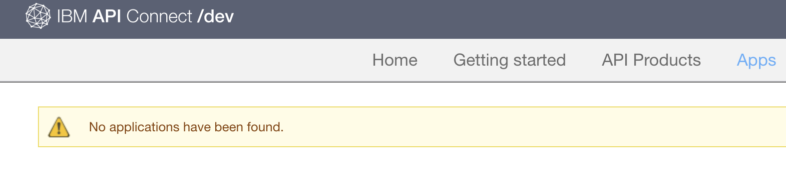

# Using the Developer Portal 

## Objective
This tutorial will help you quickly customize your {{site.data.keyword.apiconnect_full}} Developer Portal and select a theme that suits your needs.

---

## Prerequisites

Before starting this tutorial, you should get the URL to get access to the portal :

Click on the SandBox catalog in the API Management console :

Then click on setting :

Then on the left side, click on the Portal settings

At this point, you should see the URL to get access to that portal :

Click on the portal URL :

## Create a new developer account

Select **Create an account** to log in to the developer portal. 

Please specify a different email address from the administrator 

Wait one minute or two and you will receive a confirmation email in your email inbox:

Click on that link and log into the portal :

On the right part of the screen, you should see the following information (email @ and name):

---

## Inside the Developer Portal

To view the Products available in the Developer Portal, click API Products.

Choose one of the Weather API Product

To view some details information about an API, then choose an API on the left part of the screen :

For example, with the **Weather Provider API**, you can see :

You can look at the different operations and test your API.

## Subcride to an application

On the top part of the screen, choose an **Apps**

Then click on the + Create New App on the right :

Fill the Name and description fields and click **Submit** :

You should receive your credentials :

Take a note on both the client secret and the Client ID in a notepad.

## Test you API with your credentials

Test your API again : go to Products

Choose the Weather Provider API, go to Get Current Operation :

You can notice that the Client ID and Client Secret are already filled for your specific application (MyMobileApp).

## Summary
Congratulations, you have completed this tutorial. In this tutorial you learned how to:

* Login to your developer portal welcome page
* Subscribe an application to a product plan 
* Check the API with the credentials

---

